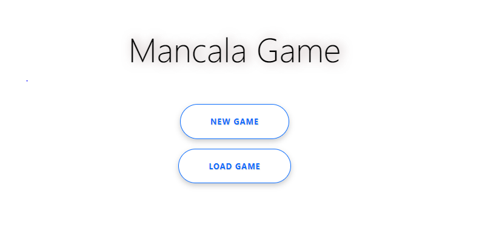
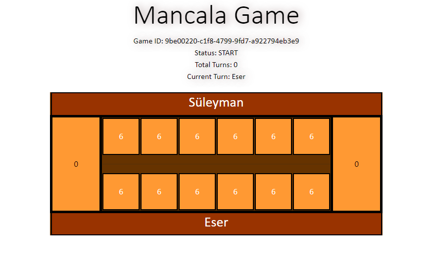

# Mancala Game (Süleyman Eser)
This is a java web application for playing Mancala game.
For the Rules of the game visit following Wikipedia link: [https://en.wikipedia.org/wiki/Mancala](https://en.wikipedia.org/wiki/Mancala)

## Tech Stack
* Java 17
* Spring Boot & REST
* Gradle 7.3+
* MongoDB
* Docker
* Spring AOP
* Springfox
* Junit5
* Mockito
* Lombok
* Openpojo
* Apache Commons
* Bootstrap
* Jquery

### Prerequisite:
* Java JDK 17
* Docker 
* MongoDB (in the case you directly want to run application without Docker)

### Built With
* Java
* Spring Boot
* Gradle

## How to start the application

### Docker
The application contain docker file and run shell script as well so in the case if docker is running on your system. 
You just need to run entry_point.sh file and application can be accessible on port 8080.

Shell script;
 - As a first step clean and build application, generates a jar.
 - Then creates a docker image for spring boot application.
 - Lastly, docker running a container which includes application service and mongodb service by using docker-compose.yml

### Clean And Build
gradle clean install

### Run the application
gradle bootRun

### Build And Test
gradle clean test

### Swagger URL
please see the link for detail of all APIs http://localhost:8080/swagger-ui/index.html

## Author
Süleyman Eser

## Screenshots
### Main Menu

### Game Screen

